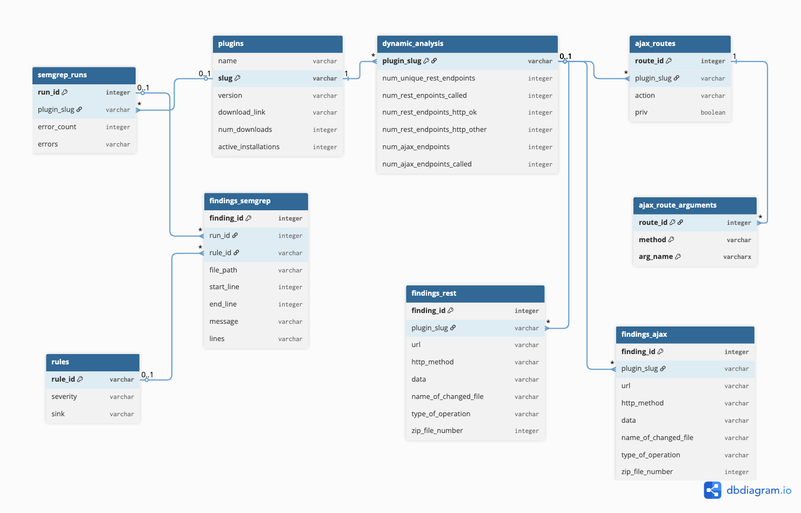

# Exposing-Information-Leaks-in-WordPress-Plugins-A-Large-Scale-Analysis
Instrumentation developed as part of my Bachelor Thesis at the SecT Chair, TU Berlin.

## Research Questions and Objectives
1. How common is it for WordPress plugins to leak sensitive information through log files or misconfigurations?
     Objective: Quantify the existing problem.
2. How can log leaks effectively be detected and prevented in an automated way?
     Objective: Implementation of static and dynamic analysis on most popular plugins.
3. Do these sensitive information leaks go unnoticed by existing security tools, how can they be improved?
     Objective: Evaluation of current state of the art of the top 2 security plugins.

## Overview
This repository is structured in 3 parts:
1. Static-analysis:  
Contains a docker-compose.yml to create a container for the analysis. One should have a secret.env file containing the SEMGREP_APP_TOKEN. This is needed for the results. In the corresponding Dockerfile one can set the NUMBER_OF_PLUGINS if one wish to limit the analysis, the default is 10.000. The Container will then do the following    
Creates a Database to store all the information gathered in the static and also dynamic analysis.  
Will download all plugins passed in plugins_sorted.csv (this is needed) with following format (Name,Downloads,Active Installs,slug,version,download_link). One can create this list by running scripts/sort-plugins-by-download.py which uses the wordpress Rest API to gather information about all available wordpress plugins and sort them by Downloads DESC.  
On Each of these plugins semgrep will be used to gather information about possible log creation. And also all possible AJAX-routes with corresponding arguments will be found and stored in the DB.

2. Dynamic-analysis:
To run ./runscript.sh
This will create 5 containers per plugin. Which will create a new wordpress instance for each plugin.  
Using some instrumentation of [PHUZZ](https://github.com/gehaxelt/phuzz/blob/main/code/web/instrumentation/overrides.d/07_pathtraversal.php) that was slightly changed, which uses uopz to hook into possible log-file-write sinks (e.g file_put_contents()) and also some other functions, each log-write will be documented.  
Per plugin following dynamic tests are run:  
a. User/Page/Post/Comment creation
b. All Rest routes found under none standard namespaces, in the Rest API (/wp-json/) will be called with a correct input having the following the specified datatype, and also incorrectly, e.g not following the data type, having very high low numbers when passing integers.
c. All Ajax-routes will be called using the findings in 1. 
3. Analysis of the Results of 1. and 2.  
This part contains querys I used on the Information stored in the database. It mainly aims to classify the found logs, and qunatify the existing problem.

The Database contains all the Information gathered in the static- and dynamic analysis.

## Quick Run

## Future Work